<div align="center">


<br/>


</div>

---

<div align="center">



</div>

---

### 🧬 Who Am I?

```javascript
const aditya = {
    role          : "B.Tech CSE Student @ SRM University AP  |  GPA: 9.35",
    patent        : "Published Inventor of the AI-Enabled Smart Trolley System (2025)",
    experience    : [
                      "Product Engineering Intern (AI) @ CCC Digital India Private Limited",
                      "Web Development Intern  @ Vaultsphere AI Technologies",
                      "Student Researcher       @ SRM University AP (EEE R&D)"
                   ],
    stack         : ["MERN", "Python", "C++"],
    currentFocus  : ["Full Stack", "AI/ML", "DSA", "System Design"],
    philosophy    : "Ship fast. Think deeper. Break things. Rebuild better."
};
```

> 💡 I engineer at the intersection of AI and full-stack development, turning research-grade ideas into production-grade systems.

---

### 📜 Intellectual Property

<table width="100%">
<tr><td>

#### 🏅 AI-Enabled Smart Shopping Trolley System
**Status:** &nbsp;`Patent Published` &nbsp;·&nbsp; Indian Patent Journal, 2025

An autonomous, IoT-integrated retail navigation framework with edge-based real-time billing. Bridges the gap between computer vision, autonomous navigation, and modern retail infrastructure. Integrates RFID, Ultrasonic, IR, and Camera modules for intelligent checkout with zero human intervention.

<p>
  
  
  
  
</p>

</td></tr>
</table>

---

### 💼 Professional Experience

**🏢 Vaultsphere AI Technologies Pvt Ltd** &nbsp;|&nbsp; *Web Development Intern*
`Feb 2026 – May 2026` &nbsp;·&nbsp; Bengaluru, India
- Architecting and shipping production-ready, full-stack web applications at scale in a hybrid startup environment.
- Optimizing backend infrastructure and contributing robust features to live production codebases.

**🏢 CCC Digital India Pvt. Ltd** &nbsp;|&nbsp; *Product Engineering Intern (AI)*
`May 2026 – July 2026` &nbsp;·&nbsp; Hyderabad, India
- Developed AI-powered product features using LLMs and intelligent automation frameworks.
- Integrated scalable AI solutions into production applications while collaborating on research, prototyping, and performance optimization.

**🔬 SRM University AP, Dept. of EEE (R&D)** &nbsp;|&nbsp; *Student Researcher*
`Oct 2025 – Present` &nbsp;·&nbsp; Vijayawada, India
- Spearheading research on a **patented AI-enabled system** under expert academic mentorship.
- Applying AI, IoT, and Web3 paradigms to interdisciplinary, real-world technical challenges.

---

### ⚙️ Technical Arsenal

<div align="center">

**Core CS Fundamentals:** OOPs &#183; DSA &#183; Operating Systems &#183; DBMS &#183; Computer Organization & Architecture

<br/><br/>

**Languages**

<a href="https://skillicons.dev"></a>

<br/><br/>

**Frontend**

<a href="https://skillicons.dev"></a>

<br/><br/>

**Backend & Databases**

<a href="https://skillicons.dev"></a>

<br/><br/>

**AI, ML & IoT**

<p>
  
  
  
  
  
</p>

<br/>

**Tools & Platform**

<a href="https://skillicons.dev"></a>

</div>

---

### 📊 GitHub Intelligence Report

<div align="center">

<!-- Full-width commit timeline -->


<br/>

<!-- Two cards side by side, properly sized -->


<br/><br/>

<!-- Streak stats, centered and prominent -->


<br/><br/>

<!-- Full-width contribution graph -->


</div>

---

### 🤝 Let's Connect & Collaborate

<div align="center">

*Open to work, research collaborations, open-source contributions, and building cool things together.*

<br/>

<a href="https://www.linkedin.com/in/aditya-kumar-575720311/">
  
</a>&nbsp;
<a href="https://adiforge-portfolio.vercel.app/">
  
</a>&nbsp;
<a href="mailto:hustlewthadi@gmail.com">
  
</a>&nbsp;
<a href="https://github.com/aditya-forge">
  
</a>

<br/><br/>


</div>
